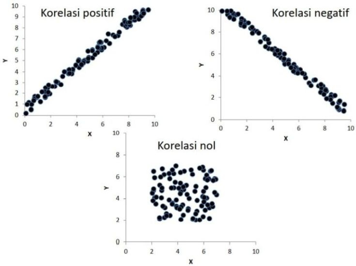

```{r xaringanExtra, echo=FALSE}
xaringanExtra::use_xaringan_extra(c("tile_view", "animate_css", "tachyons"))
```

```{r xaringan-panelset, echo=FALSE}
xaringanExtra::use_panelset()
```

```{r xaringan-scribble, echo=FALSE}
xaringanExtra::use_scribble()
```

```{r xaringan-logo, echo=FALSE}
xaringanExtra::use_logo(
  image_url = "Unsera.png"
)
```

```{r xaringanExtra-webcam, echo=FALSE}
xaringanExtra::use_webcam()
```

```{r xaringanExtra-search, echo=FALSE}
xaringanExtra::use_search(show_icon = TRUE)
```


.pull-left[
<br><br>


]

.pull-right[
<br>
# **.purple[Outline]**

- ##Pendahuluan
- ##Korelasi
- ##Uji Hipotesis untuk Korelasi

]

---

.pull.center[

## **Pendahuluan**

### Hubungan Antara 2 Peubah atau Lebih

| PEUBAH    | KASUS   | PENGUMPULAN DATA    | JENIS HUBUNGANNYA |
|:--        |:--      | :--                 |:--                |
|1. Dosis Pupuk <br> 2. Banyaknya padi yang dihasilkan | Diduga dosis pupuk mempengaruhi banyaknya padi yang dihasilkan/ha | Dosis pupuk ditentukan dahulu, faktor-faktor lain yg mempengaruhi banyaknya padi dikendalikan sehingga pengaruhnya konstan, kemudian diamati banyaknya padi yang dihasilkan | Perubahan banyaknya padi yg dihasilkan/ha dipengaruhi oleh perubahan dosis pupuk $\rightarrow$ HUB SEBAB AKIBAT |
|1. Tinggi badan <br> 2. Berat badan | Diduga tinggi badan dan berat badan memiliki hubungan | Dimulai dengan mengamati tinggi badan dahulu, disusul mengamati peubah yang dianggap relevan (berat badan), atau sebaliknya.| Pengamatan thdp kedua peubah dilakukan secara bersamaan. Sulit untuk mengatakan bahwa peru-bahan satu peubah disebabkan oleh perubahan peubah lainnya <br> $\rightarrow$ bukan HUB SEBAB AKIBAT Ingin diketahui kekuatan dan arah hubungannya|

]

---

.pull.center[

## **Pendahuluan**

| PEUBAH    | KASUS   | PENGUMPULAN DATA    | JENIS HUBUNGANNYA |
|:--        |:--      | :--                 |:--                |
|1. Banyaknya barang terjual/minggu <br> 2. Adanya hari libur/tidak <br> 3. Harga barang | Diduga banyaknya barang terjual/minggu dipengaruhi oleh berbagai peubah, misalnya harga barang, ada/ tidaknya hari libur dlm minggu tsb | Harga barang ditentukan lebih dahulu, faktor-faktor lain yg mempengaruhi banyaknya barang terjual dikendalikan sehingga pengaruhnya konstan, kemudian diamati banyaknya barang yg terjual pada minggu ada hari libur dan minggu tanpa hari libur | Perubahan banyaknya barang yg terjual dipengaruhi oleh perubahan harga dan ada/tidaknya hari libur <br> $\rightarrow$ Hub SEBAB AKIBAT |
|1. Bobot badan <br> 2. Bobot jantung | Diduga bobot badan dan bobot jantung memiliki hubungan | Dimulai dengan mengamati bobot badan terlebih dahulu, segera disusul mengamati peubah yg dianggap relevan (dalam hal ini bobot jantung), atau sebaliknya. | Pengamatan thdp kedua peubah dilakukan secara bersamaan. Sulit untuk mengatakan bahwa perubahan satu peubah disebabkan oleh peubah lainnya. <br> $\rightarrow$ bukan SEBAB AKIBAT. Ingin diketahui model matematisnya (HUB KUANTITATIF)    |

]


---

.pull.center[

## **Pendahuluan**

]

.pull-left[

###**Analisis Hubungan**

- ### Jenis/tipe hubungan
- ### Ukuran keterkaitan
- ### Skala pengukuran variabel
- ### Pemodelan keterkaitan


]

.pull-right[

### Jenis/Tipe Hubungan

.green[**Relationship**] VS .red[**Causal Relationship**]
- Tidak semua hubungan (relationship) berupa hubungan sebab-akibat

- Penentuan suatu hubungan bersifat sebabakibat memerlukan pendapat/pengetahuan
dari bidang ilmu terkait

]

---


.pull.center[

## **Pendahuluan**

]

.pull-left[

### Alat Analisis Keterkaitan

### Ditentukan oleh:

1. ### Skala pengukuran data/variabel

2. ###Jenis hubungan antar variabel

]

.pull-right[

.red[**Relationship**]

|              | Numerik                    | Kategorik                      |
| :-:          | :--:                       | :--:                           |
| Numerik      | Korelasi Pearson, Spearman | Tabel Ringkasan                |
| Kategorik    | Tabel Ringkasan            | Spearman (ordinal), Chi Square |


.red[**Causal relationship**]

|                    | $X$ : Numerik      | $X$ : Kategorik  |
| :-:                | :--:               | :--:             |
| $Y$ : Numerik      | Regresi Linier     | ANOVA            |
| $Y$ : Kategorik    | Regresi Logistik   | Regresi Logistik |

]
---

.pull.center[

## **Korelasi**

### Korelasi merupakan ukuran keeratan .red[**linier**] dari dua peubah

]

.pull-left[


]

.pull-right[


]

---

.pull.center[


]

---

.pull.center[

### Arah Korelasi


]

---

.pull.center[

## Koefisien Korelasi

]

.pull-left[

- ### Tidak menggambarkan hubungan sebab akibat
- ### Nilainya berkisar antara $-1$ dan $1$
- ### Tanda $(+)$ atau $(-)$ menunjukkan arah hubungan

  - $(+)$ searah;
  - $(-)$ berlawanan arah;

]


.pull-right[


]


---

.pull.center[

## Koefisien Korelasi Pearson

]

.pull-left[

### Untuk menelaah keeratan hubungan linear antara dua peubah numerik (skala pengukuran interval dan rasio)

### $$r=\dfrac{\text{JK}_{XY}}{\sqrt{\text{JK}_{XX} \text{JK}_{YY}}}$$

### $$-1 \le r \le 1$$

$\text{JK}_{XY}$ : Jumlah Kuadrat $XY$ <br>
$\text{JK}_{XX}$ : Jumlah Kuadrat $XX$ <br>
$\text{JK}_{YY}$ : Jumlah Kuadrat $YY$ <br>

]

.pull-right[

<br><br>

$\text{JK}_{XY}=\sum x_iy_i-\dfrac{\sum x_i \sum y_i}{n}$ 

$\text{JK}_{XX}=\sum x^2_i-\dfrac{(\sum x_i)^2}{n}$ 

$\text{JK}_{YY}=\sum y^2_i-\dfrac{(\sum y_i)^2}{n}$ 

]

---

.pull-left[

**Contoh**

Diketahui data contoh tinggi dan bobot badan

| Tinggi (cm) | 120 | 100 | 140 | 110 | 120 | 90 |
| :--    | :--: | :--: | :--: | :--: | :--: | :--:|
| Bobot (kg)  | 36 | 34 | 46 | 38 | 40 | 30 |

Tentukan koefisien dan arah korelasi dari data contoh tersebut.

___

Buat tabel seperti berikut

| Data | Tinggi $(X)$ | Bobot $(Y)$ | $XY$ | $X^2$ | $Y^2$|
| :--: | :--: | :--: | :--: | :--: | :--: |
|1| 120 | 36 | 4320 | 14440 | 1296 |
|2| 100 | 34 | 3400 | 10000 | 1156 |
|3| 140 | 46 | 6440 | 19600 | 2116 |
|4| 110 | 38 | 4180 | 12100 | 1444 |
|5| 120 | 40 | 4800 | 14400 | 1600 |
|6| 90 | 30 | 2700 | 8100 | 900 |
|Jumlah| 680 | 224 | 25840 | 78600 | 8512 |
]

.pull-right[

$\sum x_iy_i = 25840$ ; <br>
$\sum x^2_i = 78600$ ; $\sum y^2_i = 8512$ <br>
$\sum x_i = 680$ ; $\sum y_i = 224$

$\text{JK}_{XY}=\sum x_iy_i-\dfrac{\sum x_i \sum y_i}{n}=25840-\dfrac{(680)(224)}{6}$ 

$\text{JK}_{XX}=\sum x^2_i-\dfrac{(\sum x_i)^2}{n}=78600 - \dfrac{(680)^2}{6}$ 

$\text{JK}_{YY}=\sum y^2_i-\dfrac{(\sum y_i)^2}{n}=8512-\dfrac{(224)^2}{6}$

$r=\dfrac{\text{JK}_{XY}}{\sqrt{\text{JK}_{XX} \text{JK}_{YY}}}=\dfrac{\dots}{\dots}$

<br>

Arah korelasi dari data tersebut adalah ...
]

---

.pull.center[

## **Uji Hipotesis**

]

.pull-left[

### Apakah terdapat korelasi yang signifikan antara $X$ dengan $Y$?

- ### Hipotesis
  .red[**Uji dua arah**]<br>
  $H_0 : \rho=0$ (Tak ada korelasi antara $X$ dan $Y$)
  $H_1 : \rho \ne 0$ (Ada korelasi antara $X$ dan $Y$)
  
  .red[**Uji satu arah**]<br>
  $H_0 : \rho \le 0$ <br>
  $H_1 : \rho > 0$ (Ada korelasi positif) <br><br>
  $H_0 : \rho \ge 0$ <br>
  $H_1 : \rho < 0$ (Ada korelasi negatif)

]

.pull-right[

### Statistik Uji

$$t_0=\dfrac{r\sqrt{n-2}}{\sqrt{1-r^2}}$$

### Titik Kritis

.red[Uji dua arah] : $t_{\frac{\alpha}{2};(n-2)}$

.red[Uji satu arah] : $t_{\alpha;(n-2)}$

]


---
.pull-left[
### Wilayah Penolakan $H_0$ (uji dua arah)


### Kesimpulan
Tolak $H_0$ : Cukup bukti untuk menyatakan bahwa ada korelasi antara $X$ dengan $Y$ pada taraf nyata $\alpha$

]

.pull-right[

<br><br><br>
**Latihan 1**

Dari data pada contoh di slide 12, ujilah hipotesis apakah terdapat korelasi yang signifikan antara tinggi dengan bobot badan pada $\alpha=5\%$

___

**Latihan 2**

Seorang dosen berpendapat bahwa ada hubungan yang positif antara IQ mahasiswa dengan hasil UAS Statistika. Untuk menguji pendapatnya, 6 orang mahasiswa dipilih secara acak dan diperoleh data berikut.

| IQ | 110 | 120 | 125 | 130 | 130 | 140 |
| :--: | :--: | :--: | :--: | :--: | :--: | :--: |
| UAS | 90 | 80 | 90 | 95 | 85 | 95 |

Ujilah pendapat dosen tersebut dengan taraf nyata $5\%$.

]
---

.pull-left[

**Latihan 1**

Dari data pada contoh di atas, ujilah hipotesis apakah terdapat korelasi yang signifikan antara tinggi dengan bobot badan pada $\alpha=5\%$

___

**Latihan 2**

Seorang dosen berpendapat bahwa ada hubungan yang positif antara IQ mahasiswa dengan hasil UAS Statistika. Untuk menguji pendapatnya, 6 orang mahasiswa dipilih secara acak dan diperoleh data berikut.

| IQ | 110 | 120 | 125 | 130 | 130 | 140 |
| :--: | :--: | :--: | :--: | :--: | :--: | :--: |
| UAS | 90 | 80 | 90 | 95 | 85 | 95 |

Ujilah pendapat dosen tersebut dengan taraf nyata $5\%$.

]

.pull-right[

**Latihan 3**

Diketahui tabel berikut.

| Tahun | Ekspor | PDB | Investasi |
| :--: | :--: | :--: | :--: |
| 1976 | 7.4 | 15.5 | 2.6 |
| 1977 | 7.1 | 19.0 | 3.2 |
| 1978 | 8.5 | 22.8 | 3.7 |
| 1979 | 10.8 | 32.0 | 4.7 |
| 1980 | 11.6 | 45.4 | 6.7 |
| 1981 | 15.6 | 54.0 | 9.5 |
| 1982 | 24.0 | 59.6 | 11.5 |
| 1983 | 25.2 | 61.4 | 13.5 |
| 1984 | 22.3 | 86.1 | 19.0 |
| 1985 | 21.1 | 92.8 | 19.3 |
| 1986 | 21.9 | 95.3 | 19.6 |

Tentukan pasangan peubah `Ekspor`, `PDB`, dan `Investasi` yang memiliki korelasi paling kuat.

]


---

class: inverse, center, middle

# Thank you!
# See you next week

